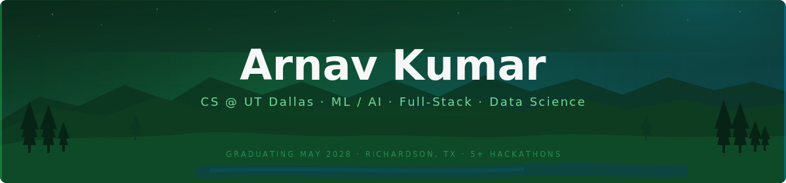

---

---

## About Me

I am a rising Junior at UT Dallas with a focus on machine learning, data science, and full-stack development. I enjoy building end-to-end systems from training and deploying ML models to designing robust backend architectures and clean frontends. I have competed in 5+ hackathons with 2 wins, and I am always looking for opportunities to build things that actually work in production.

---

## Skills

### Programming Languages

### Frameworks & Tools

### ML / Data

### Databases

---

## Featured Projects

### TrailCheck: A Full-Stack Trail Safety Web App
`NestJS` `Next.js` `TypeScript` `Prisma` `SQLite` `QLoRA` `Pydantic`

Fine-tuned a 3B-parameter instruct model (QLoRA, r=16) on structured NWS and NPS data to perform domain-specific trail safety classification. Built an end-to-end ML data pipeline transforming raw NOAA/NPS data into 660 supervised SFT examples across 12 hazard types and 4 severity levels. The backend uses AI orchestration with a local model, Gemini fallback, and rule-based fallback for resilience. Schema-validated structured output enforces a 5-field JSON contract with Pydantic validation, eliminating malformed responses. Designed for deployment on Google Cloud Platform.

---

### Deforestation Detection Model: A PyPI Package
`Python` `ONNX` `U-Net` `CUDA` `Sentinel-2`

Trained a semantic segmentation U-Net model on 10-band Sentinel-2 satellite imagery using labeled data from the University of Maryland and Google Earth Engine. Exported the model to ONNX Runtime with optional CUDA acceleration, achieving 10-15ms inference per 512x512 tile. Packaged as an installable PyPI CLI with CPU/GPU support, making the model accessible outside of research environments.

---

*I'm always open to connecting! Feel free to reach out on LinkedIn or by email.*

